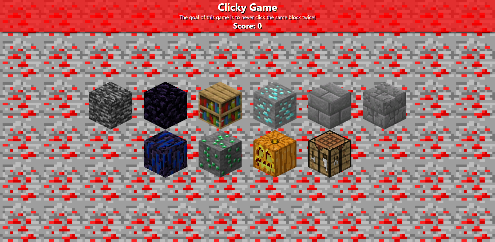

# Minecraft Themed Memory Game!

Deployed link: https://bradydouthit.github.io/react-clicky-game/

## What is it?
A game in which the goal is to only click each "block" (image) one time. If a block is clicked more than once, you lose and the game restarts.

## Tools Used
React  
JavaScript  
CSS  

## Future Updates
I would like to add a modal for events like winning/losing rather than using alerts when I have more time.
